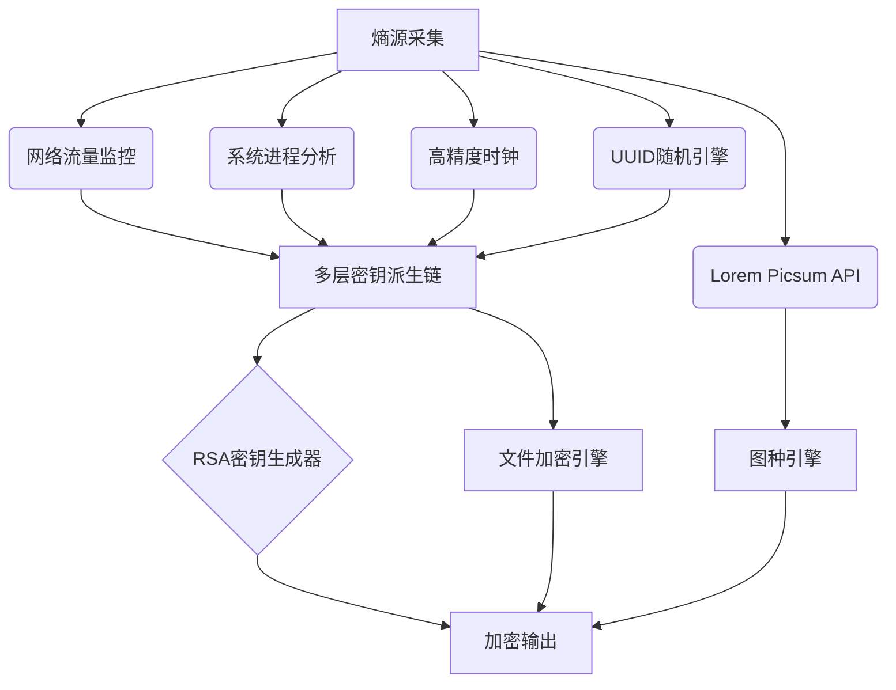

# Advanced Key Tools GUI v3.2 - 高级密钥工具图形界面

[***查看其它GUI版本***](./Directory.md)

**免责声明：此工具仅用于合法研究、加密保护和授权测试。严禁用于非法活动！**  
**开发团队对任何滥用行为不承担法律责任。**

## 🛡️ 重要声明

**请勿用于非法用途**  
**严禁将此系统用于非法活动或未经授权的目的**

本项目生成的高级密钥仅用于合法的安全研究、加密保护和授权测试场景。开发者对任何滥用行为不承担法律责任。任何使用本系统的用户都应遵守当地法律法规和国际加密技术使用规范。

---

## 🌟 项目简介

Advanced Key Tools GUI v3.2 是一款专业级安全工具包，相比v3.1新增了随机图片下载功能和增强的文件验证机制。系统采用多层熵源收集和量子安全加密技术，满足高安全场景需求。

### v3.2 新增功能
```diff
+ 1. 随机图片下载功能（从Lorem Picsum获取）
+ 2. 增强的图种验证机制（SHA-256图片哈希验证）
+ 3. 文件提取时的文件名恢复功能
+ 4. 改进的用户界面和错误处理
```

### 🔒 核心特性
- **混合密钥生成**：混合12种熵源的多级密钥派生系统
- **RSA-PKCS加解密**：支持RSA-2048/OAEP加密方案
- **隐形图种生成**：可将文件隐藏于普通图片中
- **文件加解密系统**：AES-256对称加密 + RSA密钥保护
- **硬件级别安全**：符合FIPS 140-2安全标准

### ⚠️ 重要警示
```diff
- 请勿用于非法加密勒索
- 禁止侵犯他人隐私
- 遵守当地加密技术使用法律法规
```

## 📥 安装指南

### 依赖安装
```bash
pip install -r requirements.txt
```

**依赖清单**：
```
pycryptodome==3.19.0
psutil==5.9.5
Pillow==10.1.0
PyQt5==5.15.10
```

### 启动程序
```bash
python Advanced_Key_Tools_GUI-v3.2.py
```

## 🛠️ 功能概览

### 1. 密钥生成系统（增强）
- **多层熵源采集**：
  - 实时网络数据包监控（10秒）
  - 系统进程指纹分析
  - 纳秒级时钟熵源
- **密钥派生链**：
  - PBKDF2-HMAC-SHA512 (100,000轮)
  - PBKDF2-HMAC-SHA3-512 (量子安全)
  - PBKDF2-HMAC-BLAKE2s
- **RSA密钥对**：确定性生成2048位密钥
- **输出格式**：十六进制/定制格式化密钥

### 2. RSA加密模块
- 支持PEM格式公钥/私钥
- PKCS#1 OAEP加密标准
- Base64编码密文
- 密钥导入导出功能

### 3. 图种制作器（增强）
- **随机图片下载**：直接从Lorem Picsum获取
- **文件隐藏技术**：
  - 增强型标识符格式(AKTP)
  - SHA-256图片哈希验证
  - 自动恢复原始文件名
- **双重格式支持**：
  - 作为图片查看
  - 直接提取文件

### 4. 文件无损加解密系统
- **混合加密方案**：
  - AES-256 CBC模式加密文件内容
  - RSA-OAEP加密对称密钥
- **文件格式**：专用.aktp加密格式
- **完整工作流**：
  - 加密：文件 → AES加密 → RSA加密密钥 → .aktp文件
  - 解密：.aktp文件 → RSA解密密钥 → AES解密 → 原始文件

## 🧭 使用手册

### 密钥生成
1. 点击"生成高级密钥"按钮
2. 系统自动收集熵源（约10秒）
3. 查看生成结果：
   - 格式化密钥
   - RSA公钥/私钥对
   - 唯一密钥ID
4. 可选择保存为加密ZIP文件

### RSA加解密
1. **加密**：
   - 在公钥区导入/粘贴公钥
   - 输入待加密文本
   - 点击"加密"获取Base64密文
   
2. **解密**：
   - 在私钥区导入/粘贴私钥
   - 粘贴Base64密文
   - 点击"解密"获取原文

### 图种制作器（新功能）
**获取随机图片**：
1. 点击"获取随机图片"按钮
2. 系统从Lorem Picsum下载高质量图片
3. 自动预览下载的图片

**创建图种**：
1. 选择载体图片（本地或随机下载）
2. 选择要隐藏的文件
3. 点击"创建图种"
4. 系统自动添加：
   - AKTP标识符
   - 图片SHA-256哈希
   - 原始文件名和大小

**提取文件**：
```markdown
方法1：直接操作(仅限隐藏文件时隐藏的是.zip包)
  1. 将文件扩展名改为.zip
  2. 使用任意解压工具提取
  
方法2：使用本工具
  1. 打开"图种制作器"标签页
  2. 点击"浏览图片"选择图种文件
  3. 点击"提取文件"
  4. 系统自动验证图片完整性
  5. 恢复原始文件名
```

### 文件加解密
**加密文件**：
1. 在"文件加解密"标签页
2. 输入/选择对称密钥
3. 输入/选择公钥
4. 选择要加密的文件
5. 点击"加密文件"

**解密文件**：
1. 在"文件加解密"标签页
2. 输入/选择私钥
3. 选择.aktp加密文件
4. 点击"解密文件"

## ⚙️ 技术架构



**安全机制**：
- 敏感数据内存驻留
- 临时文件自动销毁
- SHA-256完整性验证
- 抗侧信道攻击设计

## 📜 输出示例

### 图种分析结果
```
图片信息:
  文件路径: C:/images/nature_stego.jpg
  文件大小: 2,543,218 字节
  图片类型: JPEG
  图片分辨率: 1920×1080
  图片数据大小: 1,856,432 字节
  隐藏文件大小: 686,786 字节

标识符信息:
  位置: 1856432
  哈希前缀: 8f3c7b94d2
  文件名: secret_document
  文件扩展名: .pdf
  文件大小: 684,321 字节
  哈希验证: 匹配

提示:
  此文件包含有效的隐藏数据!
  文件名称: secret_document.pdf
  文件大小: 684,321 字节
```

## 💖 支持开发者
感谢您的支持！如果觉得这个工具对您有帮助，请考虑支持我们的持续开发：

https://afdian.net/a/50_83_64

## ⚖️ 开源许可

本项目采用 **MIT License**：
```text
Copyright 2025 Advanced Security Labs

Permission is hereby granted... [全文详见LICENSE文件]
```

**最终声明**：用户应确保使用方式符合所有适用法律，开发者对任何非法用途不承担责任。